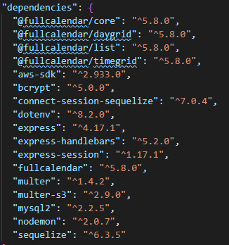
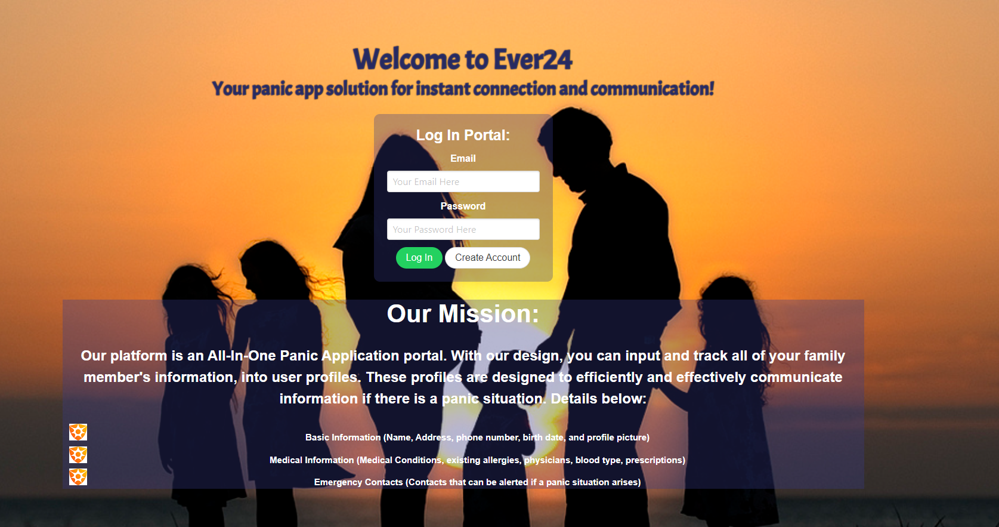
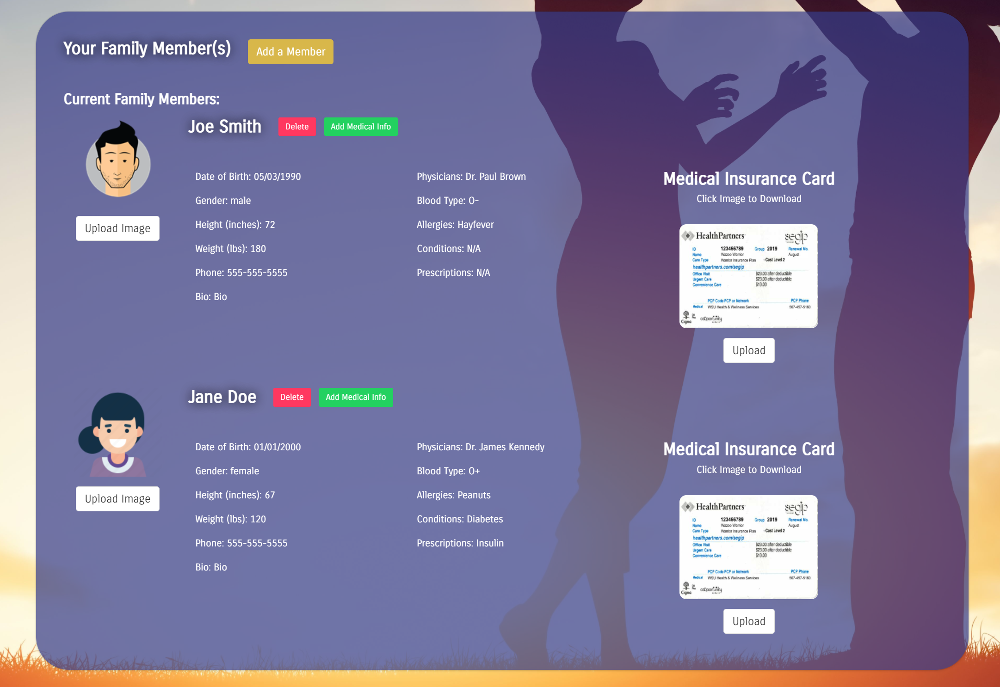
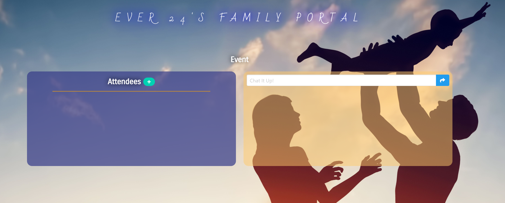
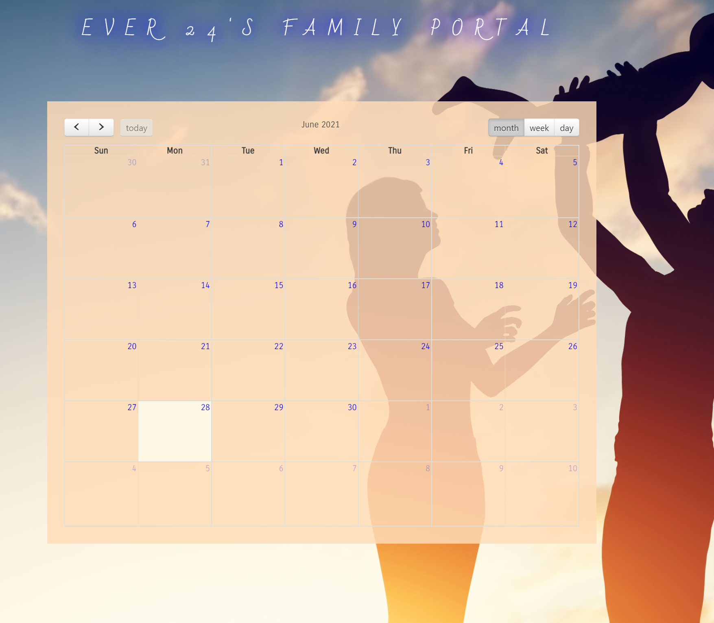
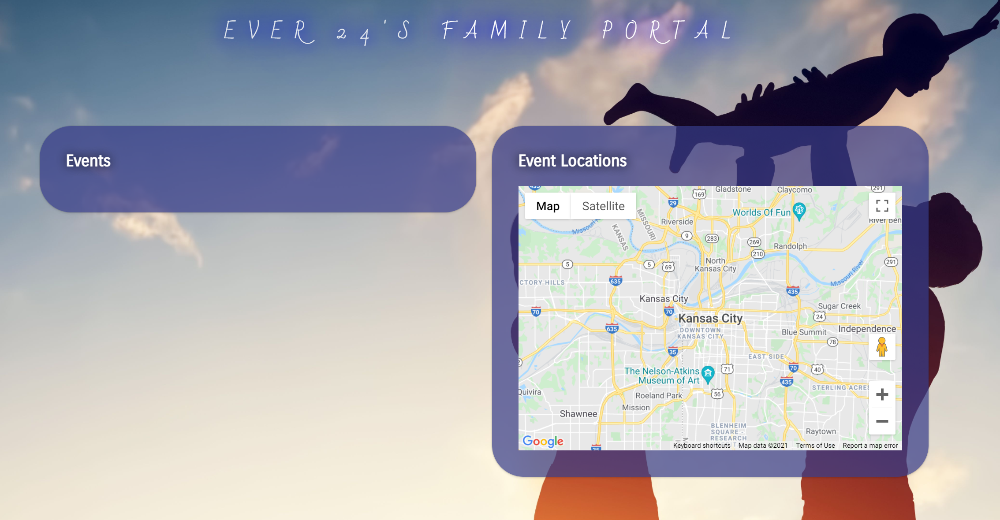

# Project #2 Ever24

## User Story

Our Ever24 app is a medical app solution for instant connection and communications for families. The Ever24 platform is an All-In-One medical application portal. With our design, you can input and track all your family member's information into user profiles. These profiles are designed to efficiently and effectively communicate information if there is a medical situation.

## Acceptance Criteria

Our app includes the following acceptance criteria:

```md
GIVEN a functional Express.js API
WHEN I add my database name, MySQL username, and MySQL password to an environment variable file
THEN I am able to connect to a database using Sequelize
WHEN I enter schema and seed commands
THEN a development database is created and is seeded with test data
WHEN I enter the command to invoke the application
THEN my server is started and the Sequelize models are synced to the MySQL database
WHEN I open the page that is deployed to heroku
THEN I am presented with a login page with the option to create a new user
WHEN I am successfully authenticated
THEN I am brought to the profile page where I can add new users to my family
WHEN I add new users to my family
THEN I can enter my new users basic info, medical info, & emergency contacts
WHEN I am done entering the user's information
THEN I can upload an image or document to the user's profile
WHEN I want to see my family's event's that they have scheduled
THEN I am given an option to look at the calender with all the event's listed
WHEN I want to schedule an event
THEN I can click on the calendar and it will route me to the "Create New Event" page with a google map
WHEN I click on each family member's event that is scheduled
THEN I am routed to the event with a chat box functionality to communicate with that user
WHEN I click on my profile page
THEN I am given a drop down menu that lists all of my own event's that are scheduled
```

## Table of Contents

If your README is long, add a table of contents to make it easy for users to find what they need.

- [Links to Application](#Links)
- [Mock-Up](#Mock-Up)
- [Install](#installation)
- [Usage](#usage)
- [Credits](#credits)
- [Test](#test)
- [Questions](#questions)

## Links

Below are links to access the deployed video link and repository.

Github Repository: https://github.com/bergannation/KU_BootCamp_Project2

Deployed Video Link: https://drive.google.com/file/d/1Aa34IR5cs9eyLRthDLEqcCQGG9LiPhgu/view

Deployed Application via Heroku: https://ever24.herokuapp.com/
## Mock-Up

The following gif shows the web application's appearance and functionality:


## Installation

The user will be required to use a variety of dependencies. The user will input the following in their command line to install the neccessary packages:

```bash
npm i
```



## Usage

The user will seed the database by using the pre-seeded files if needed. This application is deployed to Heroku and should have all the necessary files seeded. The files will be seeded by using the following command:

```bash
node seeds/seed.js
```

## Screenshot



The following are images showing the app's functionality and features:











## Tests

Testing: no testing is required


## Collaborators
Group 3: Ever24

Travis Brown @ https://github.com/bergannation

Adam Maresch @ https://github.com/amaresch52

Alex Harrington @ https://github.com/spirithoula

Stephanie Rice @ https://github.com/minnie1883
